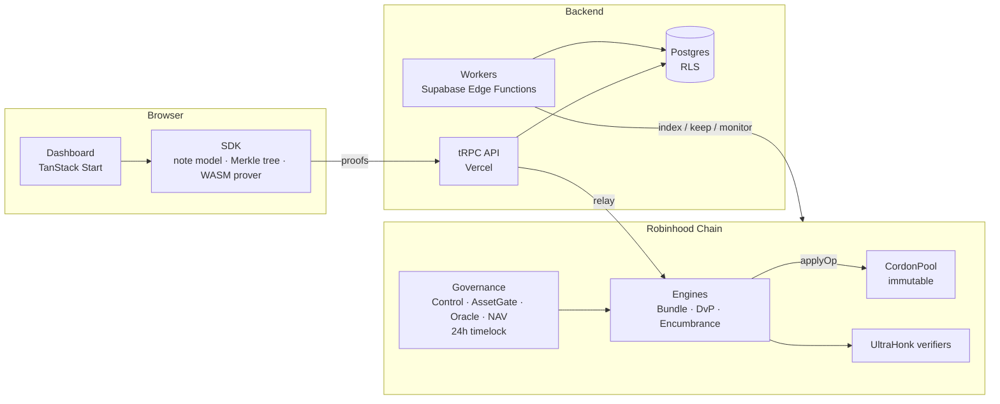

<p align="center">
  
</p>

<p align="center">
  <strong>Confidential asset servicing for tokenized stocks on Robinhood Chain.</strong><br>
  Private notes · Rights bundles · Atomic settlement · Provable NAV
</p>

<p align="center">
  <a href="https://github.com/CordonRh/Cordon/actions/workflows/ci.yml"></a>
  <a href="LICENSE"></a>
  
  
</p>

---

## Overview

Cordon is a privacy pool for tokenized stocks (Robinhood Stock Tokens, ERC-8056) on
Robinhood Chain. Holders keep Stock Tokens as **private notes** in a single shielded pool.
A note can be split into separate claims, sent privately, pledged, traded atomically
against other assets, used to attest a vault's net asset value, and withdrawn; a free
(unencumbered, unbundled) note can be withdrawn at any time.

Every note spend carries a zero-knowledge proof (Noir circuits, UltraHonk) that is
verified on-chain. The pool itself is immutable and has no owner, and withdrawals can never
be paused.

> **Status:** live on **Robinhood Chain Testnet (46630)** with faucet tokens only, at
> [usecordon.tech](https://usecordon.tech). Not yet audited by a third party; see
> [Security](#security).

## Features

| Capability | What it does |
|---|---|
| **Private notes** | Deposits become note commitments in one Merkle tree (depth 32). Notes name an asset, an amount, an owner key and a class; only the owner sees them. |
| **Rights bundles** | Split a note into PRINCIPAL, INCOME, VOTE, REDEEM and CONTROL claims, and recombine them later. INCOME claims accrue reinvested dividends through an on-chain income index. |
| **Private transfers** | Send, split and partially withdraw with a 2-in / 2-out transfer proof. A withdrawal binds its recipient inside the proof, so a relayer cannot redirect it. |
| **Encumbrances** | Pledge or lien a note to a holder. The holder releases it with a secret only it can derive, or enforces it after a declared default. |
| **Atomic DvP** | Each trader proves its own order in the browser and seals it to the sequencer. Trades settle atomically against both order proofs; no order term can be changed. |
| **Provable NAV** | A vault manager proves the value of its notes at the latest oracle prices. The attestation publishes NAV per share, total shares, liabilities and the prices used, not the holdings; an attesting vault's later spends are linkable (see [SECURITY.md](SECURITY.md)). |
| **Encrypted workspace** | Optional sync encrypts the dashboard workspace in the browser with a key derived from a wallet signature; the server stores ciphertext only. |
| **Gasless relaying** | A relayer pays gas for users' proof-carrying calls. If it refuses, the app submits the same call from the user's wallet, so exits never depend on it. |

## Architecture



| Layer | Location | Notes |
|---|---|---|
| Circuits | `circuits/` | Noir: transfer, bundle, unbundle, term, income, encumber, unlock, enforce, order, dvp, nav |
| Verifiers | `contracts/src/verifiers/` | Generated by `circuits/build.sh`; CI checks they match the circuits exactly |
| Pool | `contracts/src/CordonPool.sol` | Tokens, note tree, nullifiers, deposits (15-minute standby), withdrawals |
| Engines | `BundleVerifier`, `DvPSettler`, `EncumbranceRegistry` | Verify a proof, then ask the pool to spend and create notes |
| Income index | `ActionEngine` | Turns issuer multiplier changes into an income index; holds unexplained jumps for review |
| Governance | `CordonControl`, `AssetGate`, `PriceOracle`, `NavAttestor`, `TimelockController` | Roles, listings, Chainlink feeds and vaults, behind a 24-hour timelock |
| Checks | `SolvencyVerifier`, `ScreeningGate` | Hourly solvency (balance ≥ owed + fees); deposit screening during standby |
| SDK | `packages/sdk` | Note model, tree, browser prover, proof input builders, sealed boxes, DvP matcher |
| Shared | `packages/shared` | Chain config, ABIs, schemas, deployment manifests |
| App and API | `src/` | Dashboard and tRPC API on Vercel; hosted testnet DvP sequencer |
| Workers | `supabase/functions` | indexer, relayer, clearer, action-watcher, solvency, encumbrance-keeper, vault-registrar, monitor |
| Database | `supabase/migrations` | Indexed public data, encrypted workspace backups, sealed inbox and orders; row-level security throughout |
| Services | `services/` | Enclave DvP sequencer (AWS Nitro), prover-assist, NAV prover; not hosted yet |

Detailed design: [docs/ARCHITECTURE.md](docs/ARCHITECTURE.md) ·
Threat model: [docs/THREAT_MODEL.md](docs/THREAT_MODEL.md) ·
Invariants and their tests: [docs/INVARIANTS.md](docs/INVARIANTS.md)

## Repository layout

```text
.
├── circuits/            Noir circuits and build script (verifiers + browser circuits)
├── contracts/           Foundry project: pool, engines, governance, verifiers, scripts, tests
├── packages/
│   ├── sdk/             Note model, Merkle tree, browser prover, DvP matcher
│   └── shared/          Chain config, ABIs, zod schemas, deployment manifests
├── services/            Enclave sequencer, prover-assist, NAV prover
├── src/                 Web app (TanStack Start) and tRPC API (src/server)
├── supabase/            Migrations, database tests, edge-function workers
├── scripts/             Live testnet end-to-end tests and governance helpers
└── public/              Static assets and compiled browser circuits
```

## Getting started

### Prerequisites

| Tool | Version | Needed for |
|---|---|---|
| [Bun](https://bun.sh) | 1.3.13 | App, SDK, API and unit tests |
| [Foundry](https://getfoundry.sh) | v1.8.3 | Contracts |
| [nargo](https://noir-lang.org) | 1.0.0-beta.22 | Circuits |
| [bb](https://github.com/AztecProtocol/barretenberg) | 5.0.0-nightly.20260522 | Proving and verifier generation |

Circuits and contracts build on Linux, macOS or WSL. `circuits/build.sh` checks the
toolchain versions before it runs.

### Install, type-check and test

```sh
bun install --frozen-lockfile
bun run typecheck
bun run test          # SDK, server and app unit tests (real proofs in WASM)
bun run build
```

### Circuits and contracts

```sh
bash circuits/build.sh              # compile circuits, regenerate verifiers and browser circuits
(cd circuits && nargo test --workspace)
bash contracts/install.sh           # pinned Foundry dependencies into contracts/lib
(cd contracts && forge test)        # real proofs via ffi, fuzz and invariant tests
```

### Run the app locally

```sh
cp .env.example .env.local          # every value is optional
bun run dev
```

With no environment set, the dashboard stays fully device-local and the API reports
"not configured". Supabase and RPC settings enable sync, relaying and on-chain actions;
the on-chain path stays off until `VITE_CORDON_DEPLOYMENT` is set.

## Testing and verification

CI (`.github/workflows/ci.yml`) runs on every push:

- **App:** type-check, unit tests (Bun), edge-function tests (Deno) and production build
- **Circuits and contracts:** `nargo test`, a check that the committed verifiers and browser
  circuits are exactly what the pinned toolchain produces, and `forge test` with real
  proofs, fuzzing and stateful invariant suites
- **Symbolic checks:** Halmos properties on oracle scaling, the fee split and index math
- **Fork tests:** against Robinhood Chain mainnet (real Stock Token and Chainlink feed)
- **Static analysis and secrets:** Slither, Semgrep and gitleaks

## Deployment

- **Contracts:** `contracts/script/Deploy.s.sol` deploys and wires everything through a
  bootstrap timelock, hands control to governance with a 24-hour delay (a 2-of-3 Safe on
  mainnet; a single admin key on testnet), and drops every deployer role. `contracts/script/PostDeployCheck.s.sol` then verifies the live
  deployment against `packages/shared/deployments/<chainId>.json` and fails on any mismatch.
- **Database and workers:** `npx supabase db push` and `npx supabase functions deploy`.
  Fill in the project URL and anon key placeholders in
  `supabase/migrations/20261001000000_testnet_wiring.sql` first.
- **App:** deployed on Vercel; the deployment manifest is passed through the
  `VITE_CORDON_DEPLOYMENT` / `CORDON_DEPLOYMENT` environment variables.

| Network | Chain ID | Addresses |
|---|---|---|
| Robinhood Chain Testnet | 46630 | [`packages/shared/deployments/46630.json`](packages/shared/deployments/46630.json) · [explorer](https://explorer.testnet.chain.robinhood.com) |
| Robinhood Chain | 4663 | Not deployed |

Release `v0.1.0` is the build of record for the testnet deployment: its `contracts/src`
matches the deployed bytecode (except `CrdnStaking`, which is not deployed), and
`PostDeployCheck.s.sol` verifies the live configuration.

## Security

- **Not audited by a third party.** The testnet deployment holds faucet tokens only. Do not
  deposit real assets until an external audit of `contracts/` and `circuits/` is complete.
- Exits are never pausable and the pool has no owner. Configuration changes (engines,
  roles, listings, feeds, vaults) go through a 24-hour timelock; operational roles (guardian
  pause, keeper, sequencer) act directly within the limits listed in SECURITY.md. On testnet
  the timelock is held by a single admin key; mainnet uses a 2-of-3 Safe.
- Privileged roles, key custody, monitoring, incident response and accepted risks are
  documented in [SECURITY.md](SECURITY.md).

**Reporting a vulnerability:** please use GitHub's
[private vulnerability reporting](https://github.com/CordonRh/Cordon/security/advisories/new)
rather than a public issue.

## Contributing

Issues and pull requests are welcome. Before opening a pull request:

1. Run `bun run typecheck` and `bun run test`; for contract or circuit changes, also
   `forge test` and `nargo test --workspace`.
2. Keep the circuits, generated verifiers and SDK toolchain versions in sync (see
   `circuits/build.sh`).
3. Never commit secrets or `.env` files; CI scans every push with gitleaks.

Please report security issues privately as described above.

## License

[MIT](LICENSE) © CordonRh
